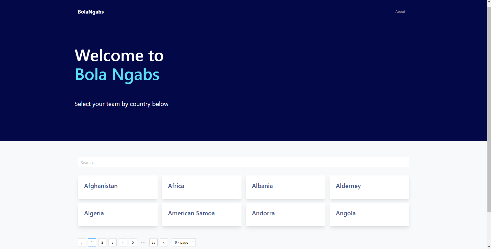
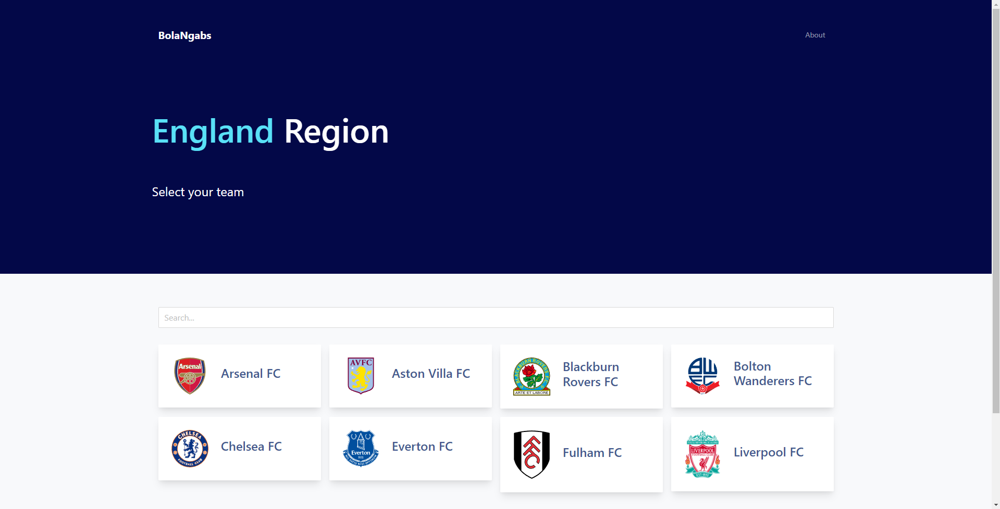
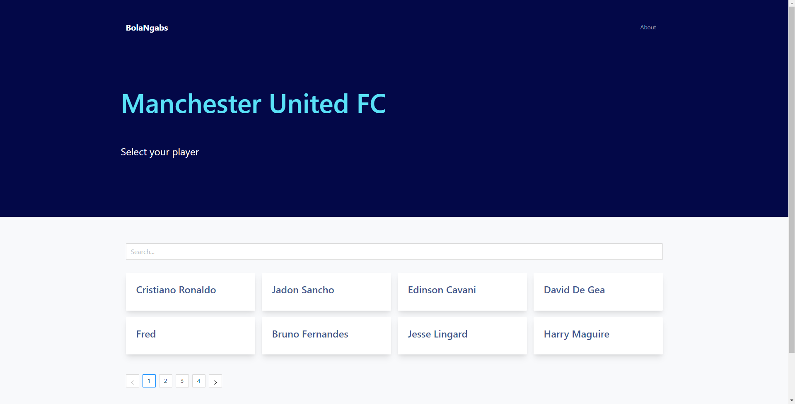
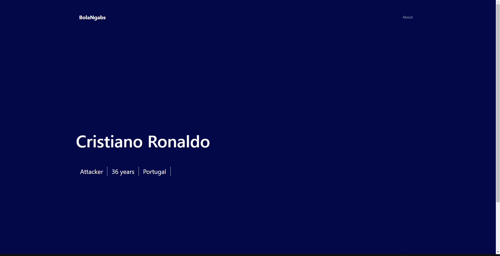

### Live site

`https://football-club.vercel.app/`

## Stack

- Next.js (React)

- Antd

- Bootstrap 5

- AOS.js

  

## How to Run

1.  `git clone https://github.com/fadhelmurphy/football-club.git`

2.  `cd football-club`

3.  `npm install` // inside football-club folder

4.  `npm run dev` // for development (inside football-club folder)

`npm run build && npm start` // for production (inside football-club folder)

  

##  **The Exercise**

The app should consist of:

1. Shows all areas.

> localhost:3000/

2. Shows all football clubs by selecting the area.

> localhost:3000/teams/2072

3. Show football club profile and its player list.

> localhost:3000/club/66

4. Show football player detail.

> localhost:3000/player/44

